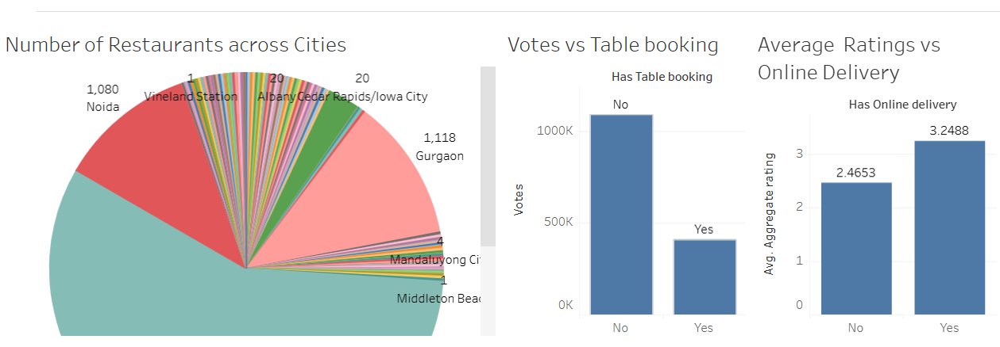
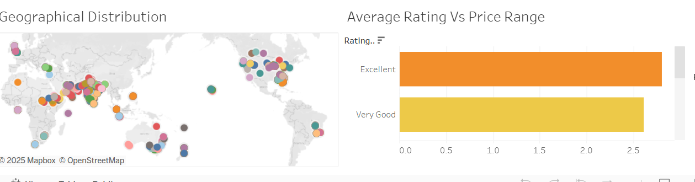

# Restaurant Data Analysis & Dashboard Development

## 📊 Project Overview
This project explores restaurant data to uncover insights that can help a restaurant consolidator revamp its B2C portal with intelligent automation.  
The analysis focuses on identifying patterns in restaurant distribution, consumer ratings, delivery and booking options, and cuisine diversity.

## 🛠 Tools & Technologies
- Python (Pandas, NumPy, Matplotlib, Seaborn)
- Exploratory Data Analysis (EDA)
- Tableau (Dashboard development)
- Data Cleaning & Preprocessing

## 🚀 Approach
1. **Data Cleaning & Preparation**
   - Handled missing values, duplicates, and standardized column names.
2. **Exploratory Data Analysis**
   - Distribution of restaurants across cities.
   - Ratings distribution and trends.
   - Franchise presence nationwide.
   - Ratio of table booking availability and online delivery options.
   - Votes comparison between delivery vs non-delivery restaurants.
   - Top cuisines across cities and diversity vs ratings.
   - Cost analysis vs other variables (ratings, cuisines, delivery).
3. **Visualization**
   - Plots created with Python (Matplotlib, Seaborn).
   - Interactive dashboard created with Tableau.

## 🔑 Key Insights
- Major cities dominate the restaurant landscape, showing market saturation and opportunities.
- Restaurants offering **delivery** and **table booking** generally receive higher customer engagement (votes).
- Cuisine diversity correlates positively with higher ratings.
- Cost significantly influences consumer decisions along with ratings.

## 📊 Sample Visualizations (Python)

### 1. No. of cuisines served vs Ave ratings


### 2. Ave rating vs price range


### 3. Ave rating vs online delivery


### 4. Ave rating vs table booking


### 5. Ave Cuisine_count vs Price range


## 📊 Interactive Tableau Dashboard

👉 [View on Tableau Public](https://public.tableau.com/views/CapstoneProject-Marketing/Dashboard1?:language=en-US&:sid=&:redirect=auth&:display_count=n&:origin=viz_share_link)

### Tableau Dashboard (Screenshots)
  


## 📂 Repository Structure
```
/Restaurant-Analysis-Project
  ├── Capstone_Project3.ipynb       # Jupyter Notebook with analysis
  ├── Portfolio_Report.pdf          # Professional project summary
  ├── /images                       # Charts + Tableau screenshots
  └── README.md                     # Project documentation
```

## 👩‍💻 Author
**Munawer Jabeen**  
📧 Email: munawerjabeen703@gmail.com  

---
⭐ If you found this project helpful, feel free to star the repository!
